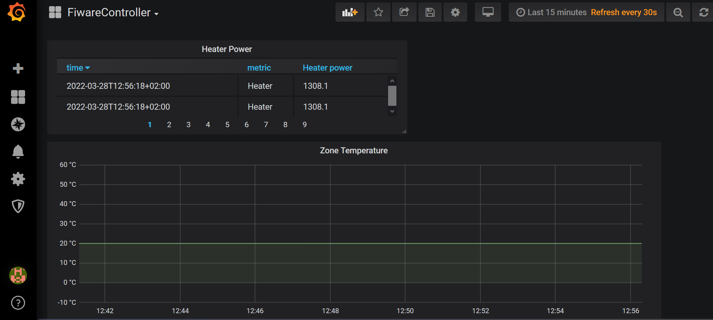

# Examples of PID4FIWARE

Here are some examples that can help you get familiar with PID4FIWARE.

## Prerequisites

- Docker

    [Docker](https://www.docker.com/) has to be installed on your local machine.

- n5geh plattform

    You must have access to a [n5geh plattform](https://github.com/N5GEH/n5geh.platform), which can be hosted on your local machine or somewhere else. For these examples, it is recommended that you host a platform on your local machine.

- Python

    Python 3 must be installed on your local machine because these examples are all written in python scripts. Besides, the developed library [FiLiP](https://github.com/N5GEH/FiLiP) must be installed.

## Starting Services

Before starting up the services here, you need to ensure that the n5geh platform is running and you have access to it. If you host the platform on your local machine, you do not need to adjust the parameter settings of these examples. Otherwise, you will have to first change the environment parameters in `~\n5geh.services.controller\PIDControl\docker-compose.yml`, e.g. the URL of context broker `CB_URL`. For details about each parameter, please view the docker-compose file.

Then you can change your working directory to `~\n5geh.services.controller\PIDControl` and start the PID4FIWARE and a GUI control panel using the `docker compose` command:

```bash
cd \n5geh.services.controller\PIDControl
docker compose up -d
```

If everything goes well, you should see two running containers right now.


> **NOTE:** This `docker-compose.yml` should only be used for setting up these examples. For actual use, please refers to the instruction [here](https://github.com/N5GEH/n5geh.services.controller/tree/master/PIDControl).

## Example 1: Control a Virtual Thermal Zone with PID4FIWARE

In this example, a thermal zone is simulated by the model in `simulation_model.py`, which mainly contains three components: an ambiance, a thermal zone, and an electrical heater (variable heating power). The simulation is conducted in `simulation_main.py`, which sends the data of the simulated thermal zone to the n5geh platform. The information of each device can be viewed in `devices.json`.

This example aims to demonstrate the basic functionality of PID4FIWARE. Therefore, the thermal zone will be simulated twice under the same condition. In the first simulation, the heating power is fixed to 2 KW, while in the second one, the heating power should be controlled by PID4FIWARE.

Run `example_thermal_zone_control.py` to start the simulations. You will receive a hint that tells you to turn off the controller, which can be done with:

```bash
docker stop pid4fiware
```


Then you can continue with the first simulation. After that, you will be required to turn on the controller again.

```bash
docker start pid4fiware
```

When the simulation is finished, the results are illustrated just as follows. It can be seen that PID4FIWARE did make a change to the virtual thermal zone.


As the next step, you may open the GUI control [panel](http://localhost:80) to simulate with different control parameters. Feel free to explore more!

> **NOTE:** The GUI control panel reads/updates the control parameters on the n5geh platform. Therefore, this is not the only way but a convenient way to change the control parameters.

## Example 2: Tune the Control Parameters Manually

This example is based on the same simulation model as the last one but uses a much slower simulation time. It will take more than two hours to complete the whole simulation, which allows live monitoring of the virtual zone temperature. Therefore a real tuning process of the control parameters can also be imitated in this example.

Run `example_online_tuning.py` to start the simulation. The n5geh platform provides a monitoring tool Grafana to visualize time series data. If you host the n5geh platform on your local machine, Grafana can be accessed [here](http://localhost:3001/) (Username: "admin", password: "admin", by the first login).

After logging in, a `PostgreSQL` datasource must be set up [here](http://localhost:3003/datasources) with the following values.

- **Name:** Controller (an arbitrary name)
- **Host:** crate:5432 (crate is the host name of CrateDB inside the docker network, 5432 is an internal open port for SQL query)
- **Database:** mtcontroller (mt + fiware service name)
- **User:** crate
- **SSL Mode:** disable


Then you need to configure a dashboard to visualize the data. A configuration for this example can be loaded by importing `Grafana_Template.json` [here](http://localhost:3001/dashboard/import).

> **NOTE:** If the above settings may not work correctly, please view the information in CrateDB (http://HOSTNAME:4200/#!/tables/) and then adjust the settings in Grafana.

Now you should be able to monitor the live change of the zone temperature and the heating power just like below.



You can now open the control [panel](http://localhost:80) and use your expertise with the PID controller to tune the control parameters!
