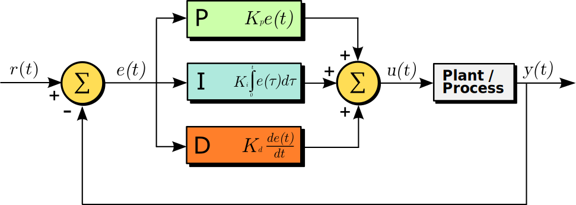

# PID4Fiware

### Principle of PID Controller
The PID controller (proportional-integral-derivative controller) is commonly used in automation to control SISO (Single Input, Single Output) systems. The PID controller adjusts the control variable *u* (e.g. a valve opening or heating power) to minimize the error between the process variable *y* (e.g. volume flow or temperature) and a given setpoint. A typical control block is illustrated in the following figure ([*source*](https://en.wikipedia.org/wiki/PID_controller#/media/File:PID_en.svg)).



### Description of PID4Fiware
PID4Fiware provides a PID controller that can control a system via the [FIWARE IoT platform](https://github.com/N5GEH/n5geh.platform). PID4Fiware is virtualized into [docker](www.docker.com) container, which makes it simple to deploy. PID4Fiware is based on the controller framework for FIWARE, Controller4Fiware. For the PID algorithm, the public library [simple-pid](https://pypi.org/project/simple-pid/) is used.

For each deployment, PID4Fiware creates a controller entity in the Orion context broker of the IoT platform. The controller entity holds the following attributes:

| Attribute Name | Description                         |
|----------------|-------------------------------------|
| setpoint       | Setpoint of the process variable    |
| kp             | Proportional gain of PID            |
| ki             | Integral gain of PID                |
| kd             | Deviation gain of PID               |
| limLower        | Lower limit of the control variable |
| limUpper      | Upper limit of the control variable |

In other words, these control parameters are stored on the IoT platform, which can be adjusted by sending requests to the Orion context broker. Note that the reverse mode (reverse action, e.g. control cooling power based on room temperature) can be activated by assigning negative values to `kp`, `ki`, and `kd`. This data structure as well as initial values of the parameters are defined in the configuration file `config/controller.json`

In order to take measurements and actions, the PID controller has to know the entity name and the attribute name of the sensor and actuator devices. This information is given in the configuration files `config/input.json` and `config/command.json`. Although the sensor/actuator devices may have multiple attributes, only the measured/controlled one should be given in the configuration files.

> **NOTE:** The `config/output.json` is not used and left empty in this case.

Except the information about the sensor and actuator, some other information must still be given to the PID controller as environment variables, including the platform-specific data (e.g. context broker url), controller entity id/type, sampling time, etc. All supported environment variables are shown below.

| Name                   | Example Value                      | Descriptions                                               |
|------------------------|------------------------------------|------------------------------------------------------------|
| CB_URL                 | <http://host.docker.internal:1026> | URL of the Orion context broker FROM INSIDE THE CONTAINER! |
| QL_URL                 | <http://host.docker.internal:8668> | URL of the QuantumLeap FROM INSIDE THE CONTAINER!          |
| FIWARE_SERVICE         | controller                         | Fiware service name                                        |
| FIWARE_SERVICE_PATH    | /                                  | Fiware service path                                        |
| CONTROLLER_ENTITY_ID   | urn:ngsi-ld:PIDController:001      | Entity ID of the PID controller                            |
| CONTROLLER_ENTITY_TYPE | PIDController                      | Entity Type of the PID controller (no need to modify)      |
| SAMPLING_TIME          | 1                                  | Sampling time of the controller in second                  |
| SECURITY_MODE          | False                              | Whether to use security mode                               |
### Quick Start
Containers can be easily deployed with the ``docker-compose.yml`` file.

**Download repo**
```bash
git clone https://github.com/N5GEH/n5geh.services.controller.git
cd n5geh.services.controller
cd PIDControl
```
**Build images**
```bash
docker compose build
```
**Start containers**
```bash
docker compose up -d
```
> **NOTE:** This section demonstrates a quick deployment. It should be straight forward for docker experts. For more general deployment and docker beginner, please refer to **Deployment** section below.

### Deployment

The container of PID4Fiware can either be built and then run locally or pulled directly from the docker hub.

The first option is to build an image locally. You need to clone this repository to your local computer or virtual machine (VM) and then change the working directory to `\n5geh.services.controller`:

```bash
git clone https://github.com/N5GEH/n5geh.services.controller.git
cd n5geh.services.controller
```

Then you can build the image using the `docker build` command:

```bash
docker build -f PIDControl/Dockerfile --tag pid4fiware .
```

After that, you should create a file `PIDControl/.env` and set up the environment variables there properly. An example of this file is already given as `PIDControl/.env.EXAMPLE`.

Most importantly, you must set up the entity information in `PIDControl/config/input.json` and `PIDControl/config/command.json`. The `id`, `type`, and the attribute name are the most important information and must be given correctly. Besides, you can also set initial values for the control parameters in `PIDControl/config/controller.json`. Then you can pass these configuration files into a docker volume and start the container with following command:

```bash
docker run -d \
    --env-file .env \
    --volume "../keycloak_token_handler/.env:/app/keycloak_token_handler/.env" \
    --volume "./config:/app/config"
    --restart always \
    --name pid_controller_1 \
    pid4fiware
```

Then the PID controller should now work properly.

> **NOTE:** The `pid_controller_1` from the above two commands is an example container name. It is recommended to name your container to something meaningful (e.g. `R2010_t_controller` for the temperature controller of room 2010).

The second option is to use the online image on docker hub [here](https://hub.docker.com/r/dummy/pid4fiware) (note that this image may not always be updated):

```bash
currently not supported
```

### Testing/Development
For development or testing, the PID controller can also be started from the python console. The configuration file under `PIDControl/config` should first be set up correctly, and then `PID4FIWARE.py` can be run from the python console. However, the PID controller interacts with the local FIWARE platform by default (hostname=localhost). Otherwise, you need to manually change the default values of the FIWARE parameters in `Controller.py`.

# Control Panel

The control panel is a web-based GUI interface of the PID controllers. It simply reads/sends control parameters from the Orion context broker and displays the data in a user-friendly way. It must be addressed that this panel is mainly designed for demonstration and learning. It is not recommended to use this panel to interact with the deployed PID controller in real practice because **there is no guarantee for its reliability and functionality**.

This control panel can also be run as a docker container. Firstly, you should build a local image named `pidpanel`:

```bash
cd PIDControl/control_panel
docker build --tag pidpanel .
```

Secondly, you must adjust the following environment variables in `docker-compose.yml`.

| Name        | Example Value                     | Descriptions                                               |
|----------------------|-----------------------------------|------------------------------------------------------------|
| CB_URL               | <http://host.docker.internal:1026>  | URL of the Orion context broker FROM INSIDE THE CONTAINER! |
| FIWARE_SERVICE       | controller                        | Fiware service name                                        |
| FIWARE_SERVICE_PATH  | /                        | Fiware service path                                        |

Finally, the container can be started by:

```bash
docker compose up -d
```

If you use the default settings, you should be abel to open the control panel [here](http://localhost:80) and see the interface below. If multiple PID controllers have been deployed, you can select one in the dropdown list.


