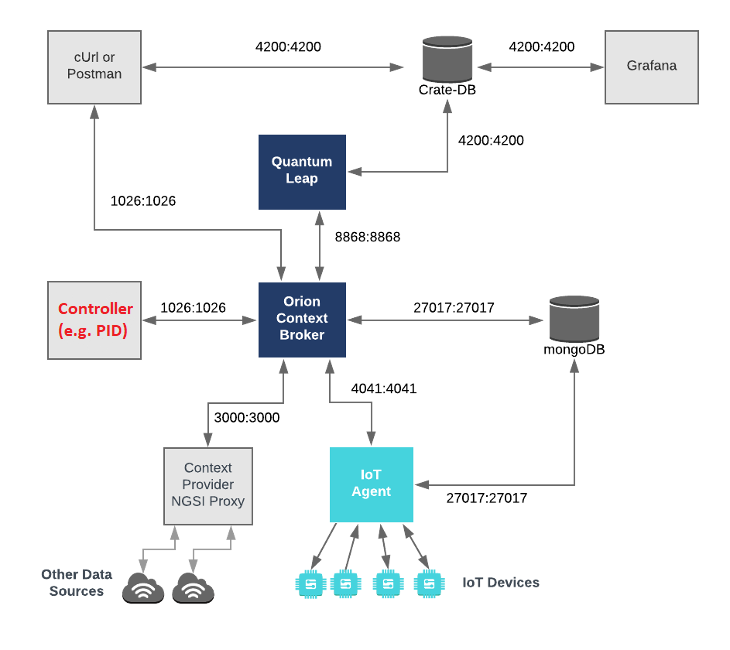

# Overview

This repository contains controllers that control IoT devices via the FIWARE framework.
Figure 1 illustrates the communication with the fiware framework: The controller service gets the current value of the IoT devices from the orion context broker
and sends commands to the context broker that are passed to the IoT devices afterwards.
The [filip](https://github.com/N5GEH/n5geh.tools.FiLiP) library is used for the communication with the orion context broker.

***Figure 1:*** *Overview of the framework and controller integration (adapted from: https://fiware-tutorials.readthedocs.io/en/latest/iot-over-mqtt/index.html)*

## Services

**PIDcontrol service** 

This service includes a PID controller that communiates with the controlled system (IoT devices) via the fiware platfrom.
The controller receives the process variable (measurement) from the context broker with a http get request.
The computed control variable (actuation) is send back to the context broker afterwards and passed as a command to the  IoT device (actuator).

# Publications

We presented the services in the following publications:

- Baranski, M., Storek, T. P. B., Kümpel, A., Blechmann, S., Streblow, R., 
Müller, D. et al.,
(2020). National 5G Energy Hub : Application of the Open-Source Cloud Platform 
FIWARE for Future Energy Management Systems. 
https://doi.org/10.18154/RWTH-2020-07876

- T. Storek, J. Lohmöller, A. Kümpel, M. Baranski & D. Müller (2019). 
Application of the open-source cloud platform FIWARE for future building 
energy management systems. 
Journal of Physics: 
Conference Series, 1343, 12063. https://doi.org/10.1088/1742-6596/1343/1/012063

# License

- [MIT-License](LICENSE)

# Copyright

2020, RWTH Aachen University, E.ON Energy Research Center, Institute for Energy 
Efficient Buildings and Indoor Climate

# Contact

- [Alexander Kümpel](https://www.ebc.eonerc.rwth-aachen.de/cms/E-ON-ERC-EBC/Das-Institut/Mitarbeiter/Team2/~nepb/Kuempel-Alexander/)

[Institute for Energy Efficient Buildings and Indoor Climate (EBC)](http://www.ebc.eonerc.rwth-aachen.de)  
[EON Energy Research Center (EONERC)](http://www.eonerc.rwth-aachen.de)  
[RWTH University Aachen, Germany](http://www.rwth-aachen.de)
