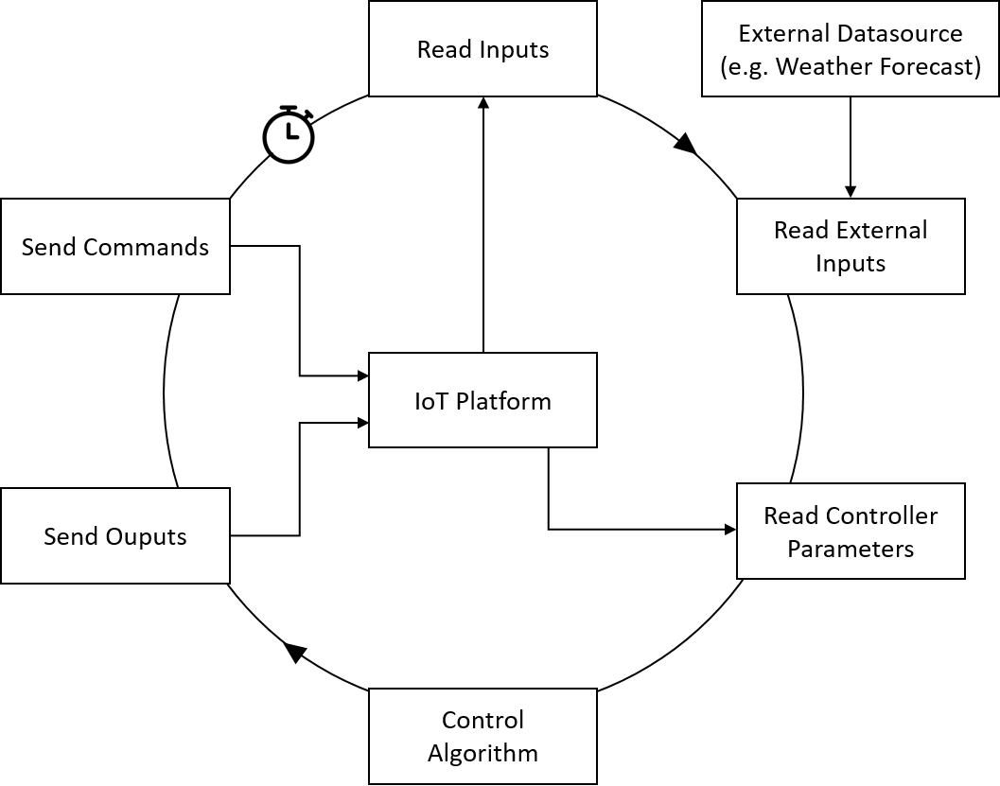

# Overview

This repository contains controllers that control IoT devices via the [FIWARE IoT platform](https://github.com/N5GEH/n5geh.platform).
Figure 1 illustrates the communication with the fiware framework: The controller service gets the current value of the IoT devices from the orion context broker
and sends commands to the context broker that are passed to the IoT devices afterwards.
The [FiLiP](https://github.com/N5GEH/FiLiP) library is used for the interaction with the IoT platform.

***Figure 1:*** *Overview of FIWARE platform and controller integration (adapted from: https://fiware-tutorials.readthedocs.io/en/latest/iot-over-mqtt/index.html)*

## Controller Framework

For different use cases, different controllers are required. In order to simplify and accelerate the development process of a new controller that interact with FIWARE IoT platform, a controller framework, Controller4Fiware, is proposed in this repository. This framework serves as the keystone of any concrete controller algorithm, for example PID controller, model predictive controller (MPC), etc.

**Basic Structure**

Controller4Fiware includes the fundamental functions that a controller requires for the interaction with FIWARE IoT platform. In addition, a control cycle is formulated, which is supposed to represent the working cycle of the most controllers.

As shown in Figure 2, the control cycle begin with "Read Inputs". In this step, the controllers query the input variables, e.g. the measurements of sensors, from the FIWARE IoT platform. Then follows "Read External Inputs", in which the controller acquire input variables that come from external datasource, e.g. online weather forecast. In the next step, "Read Controller Parameters", the parameters of the controller, e.g. proportional gain kp of a PID controller, are read from the IoT platform. After that, the controller algorithm is executed in "Control Algorithm". The controller mainly calculated the commands and output variable (if any) based on the current input variables and controller parameters. In the last two steps "Send Outputs" and "Send Commands", the calculated outputs and commands are sent to the IoT platform. At the end of each control cycle, the controller will wait until the fixed sampling time is up. Thereafter, the next control cycle begins.

***Figure 2:*** *Overview of the control cycle*

Controller4Fiware uses the [FiLiP](https://github.com/N5GEH/FiLiP) library to interact with FIWARE platform, i.e. reading inputs/parameters or sending outputs/commands.

**Configuration Files**

In oder to interact with the FIWARE platform, the controllers need to know the data structure on the platform, i.e. which devices can take measurements or make actions and how dose the controller look like. For this purpose, each concrete controller must define four configuration files in `config` folder: `input.json`, `output.json`, `command.json`, and `controller.json`.

`input.json` contains the entities and their attributes, which should be taken as input variables. The controller reads their values in every control cycle.

`output.json` contains the entities and their attributes, which should be taken as output variables. The controller updates their values in every control cycle.

`command.json` contains the actuator entities (devices that have commands) and their commands, which are updated by the controller in every control cycle.

> **NOTE:** The entities can have many attributes, some of which are not relevant for the controller, e.g. relationships or some static attributes. Therefore, only the measured/controlled attributes should be given in the configuration files.

> **NOTE:** Commands and output variables are different. The commands will be forwarded to the devices, while the output variables will only be updated on the platform. If no output variables are required, `output.json` can be left empty.

`controller.json` defines the data structure of a concrete controller, i.e. which parameters are required (e.g. kp, ki, and kd for a PID controller). These parameters will be read from FIWARE platform in every control cycle.

## Existing Controller Services

**PIDcontrol service** 

This service includes a PID controller that communicates with the controlled system (IoT devices) via the fiware platform.
The controller receives the process variable (measurement) from the context broker with a http get request.
The computed control variable (actuation) is sent back to the context broker afterwards and passed as a command to the  IoT device (actuator).

This PID controller is based on the upon described controller framework, and can be taken as an example to implement a concrete controller.

# Publications

We presented the services in the following publications:

- Baranski, M., Storek, T. P. B., Kümpel, A., Blechmann, S., Streblow, R., 
Müller, D. et al.,
(2020). National 5G Energy Hub : Application of the Open-Source Cloud Platform 
FIWARE for Future Energy Management Systems. 
https://doi.org/10.18154/RWTH-2020-07876

- T. Storek, J. Lohmöller, A. Kümpel, M. Baranski & D. Müller (2019). 
Application of the open-source cloud platform FIWARE for future building 
energy management systems. 
Journal of Physics: 
Conference Series, 1343, 12063. https://doi.org/10.1088/1742-6596/1343/1/012063

# License

- [MIT-License](LICENSE)

# Copyright

2020, RWTH Aachen University, E.ON Energy Research Center, Institute for Energy 
Efficient Buildings and Indoor Climate

# Contact

- [Alexander Kümpel](https://www.ebc.eonerc.rwth-aachen.de/cms/E-ON-ERC-EBC/Das-Institut/Mitarbeiter/Team2/~nepb/Kuempel-Alexander/)

[Institute for Energy Efficient Buildings and Indoor Climate (EBC)](http://www.ebc.eonerc.rwth-aachen.de)  
[EON Energy Research Center (EONERC)](http://www.eonerc.rwth-aachen.de)  
[RWTH University Aachen, Germany](http://www.rwth-aachen.de)

# Acknowledgement

We gratefully acknowledge the financial support provided by the BMWi (Federal Ministry for Economic Affairs and Energy), promotional reference 03ET1561A/B/C
